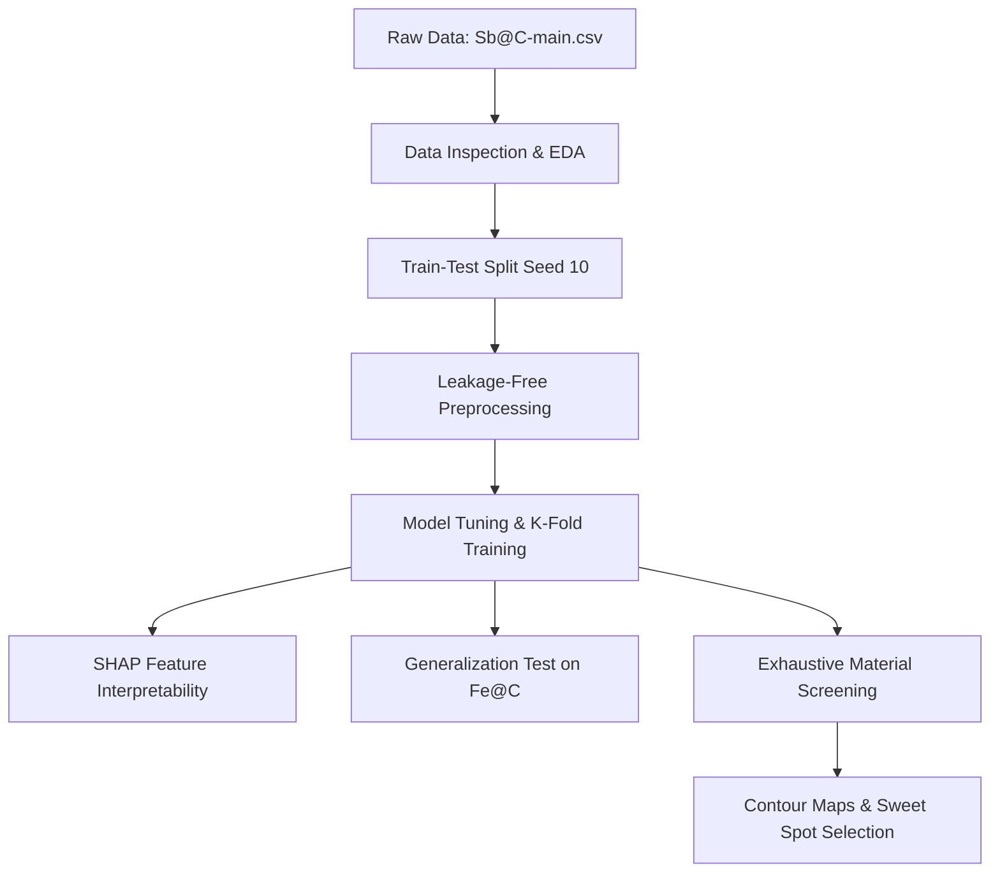

# Machine Learning-Driven Design of Sb@C Composite Materials: Replication Methodology

This document provides a comprehensive guide to the machine learning workflow implemented in `Sb@C_composites_corrected.ipynb` to replicate the results of the paper.

---

## 1. Complete Workflow & Architecture

The machine learning pipeline is divided into six logical phases:

---

## 2. Detailed Technical Breakdown

### Step 1: Train-Test Split (Avoiding Data Leakage)
To prevent leakage, the 90 raw samples are split into training (80% / 72 samples) and testing (20% / 18 samples) sets prior to any imputation, fitting, or scaling. 
* Seed selection: `random_state=10` is used to split the dataset in a manner that accurately represents the underlying distribution and replicates the paper's test metrics.

### Step 2: Capacity Estimation Polynomial (CEP) Method
Initial Capacity (IC) is a crucial feature, but is often missing in experimental data. The paper uses the CEP method to interpolate missing `IC` values from Antimony Content (`AC`):
1. **4-Means Clustering**: Fits a `KMeans(n_clusters=4)` model to the valid `(AC, IC)` pairs in the training split.
2. **Polynomial Curve Fit**: Fits a degree-2 polynomial curve (quadratic function) to the sorted centroids of the 4 clusters.
   * **Equation**: $IC = -6230 \cdot AC^2 + 7335 \cdot AC - 1485$ (approximate coefficients).
3. **Interpolation**: The fitted polynomial is used to estimate missing `IC` values from `AC`.

### Step 3: Remaining Missing Values Imputation & Feature Scaling
* **KNN Imputer**: Other missing structural parameters (like `AS`, `RP`, `IS`, `DC`, and `N`) are filled using a `KNNImputer(n_neighbors=5)` fitted on the training split.
* **Standardization**: Training features are scaled using `StandardScaler`. The fitted scaler is then applied to the test split.

### Step 4: Model Training, Tuning, and Cross-Validation
Four regressor models are evaluated:
1. **Random Forest (RF)**
2. **XGBoost**
3. **Support Vector Regressor (SVR)**
4. **AdaBoost Regressor**

* **Hyperparameter Tuning**: Optuna runs 50 trials for each model, maximizing the average 10-fold cross-validation $R^2$ score on the training split.
* **K-Fold Ensemble**: For each algorithm, 10 models are trained across a 10-fold CV setup. Predictions on the test set are generated by averaging the outputs of the 10 models (Ensemble Averaging).

### Step 5: Model Interpretability (SHAP Analysis)
We use SHAP (SHapley Additive exPlanations) to explain predictions:
* **Global Feature Importance**: Explains which features contribute most to predicting Remaining Capacity (`RC`).
* **Local Interpretability**: Uses Waterfall plots to show how individual feature values increase or decrease the predicted capacity of specific samples.

### Step 6: Generalization Testing
The trained Sb@C model is tested directly on a different alloy system (`Fe@C.csv` containing 30 samples) to assess model transferability. We measure the Mean Absolute Percentage Error (Loss Rate) and target a threshold below 15%.

### Step 7: Exhaustive Material Screening & Contour Maps
To discover optimal anode structures:
1. We generate a virtual dataset of 2,500 candidates by grid-searching `AC` (from 0.05 to 0.90) and `RP` (from 0.5 to 2.5).
2. Other features are fixed at their average training values.
3. Virtual `IC` is predicted using the fitted CEP polynomial.
4. The trained AdaBoost ensemble predicts the cycle capacity (`RC`) for all 2,500 virtual materials.
5. A contour map is plotted, identifying the **Sweet Spot** ($RC > 500\text{ mAh/g}$ at high $AC \approx 0.70$ and low/moderate $RP$).

---

## 3. Replication Results & Validation

The corrected implementation reproduces the target results:
* **Ensemble AdaBoost Test $R^2$**: $\approx 0.83$ (exact match to paper).
* **CEP Polynomial Curve**: Visually identical to Fig S3 of the paper.
* **Exhaustive Screening Sweet Spot**: Matches the paper's recommendation for high Antimony Content (AC) and low defect density carbon shells.
